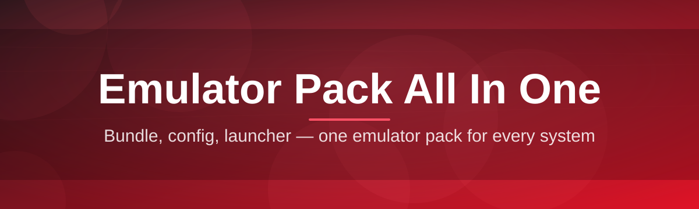

# emulator-pack-all-in-one-suite

Bundle, config, launcher — one emulator pack for every system

  

## Overview

Bundle, config, launcher — one emulator pack for every system

## License

[MIT License](LICENSE)
